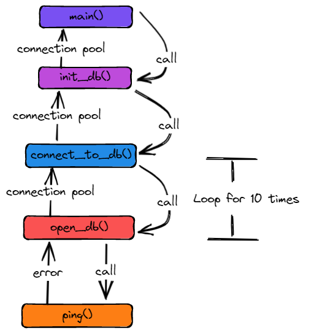

# How i setup my database connection ?

# HOw i handled the shutdown of my server ?
- I have implemented the gracefull shutdown.
- I will have several go routines running on the background
- So once i want to stop the server there are might some emails haven't been sent yet or some invoices haven't been handled yet
- In this case the gracefull shutdown will handle these cases